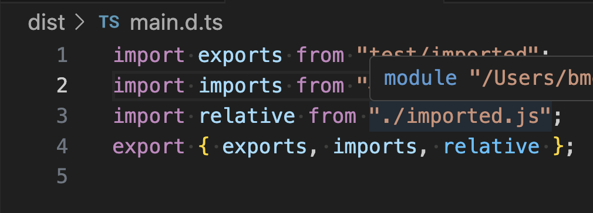
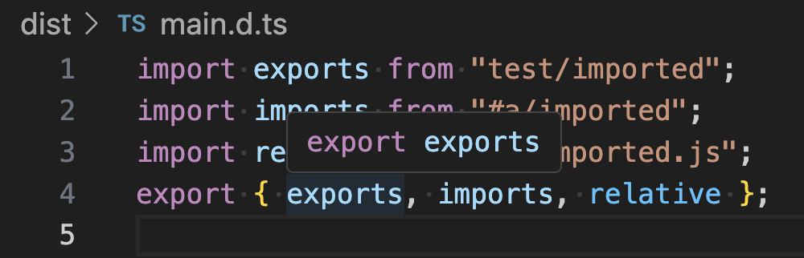

# Problem

Given a `src/` directory outputting into `dist/` , `package.json#imports/exports` are mistargetted due to TS not rewriting them. This messes up type acquisition etc. while developing in `src/` or running with a TS aware runtime.

# Example solution

Make 2 different package.json files in `src/` and `/` and ensure declaration is emitted as shown in `tsconfig.json`.

In `src/package.json` 
* set `"name"`` for self referencial bare specified
    * set exports for imports to target `src/**` files
* set imports for imports to target `src/**` files

In `package.json`
* set `"name"` for self referencial bare specified
    * set exports for imports to target `dist/**` files
* set imports for imports to target `dist/**` files

# Issues

Self reference and imports via package.json are not picked up by JS files.

Due to being only able to resolve relative paths fully in dist:

The types of imported values differ between `src/`` and `dist/` even with declaration being emitted.

